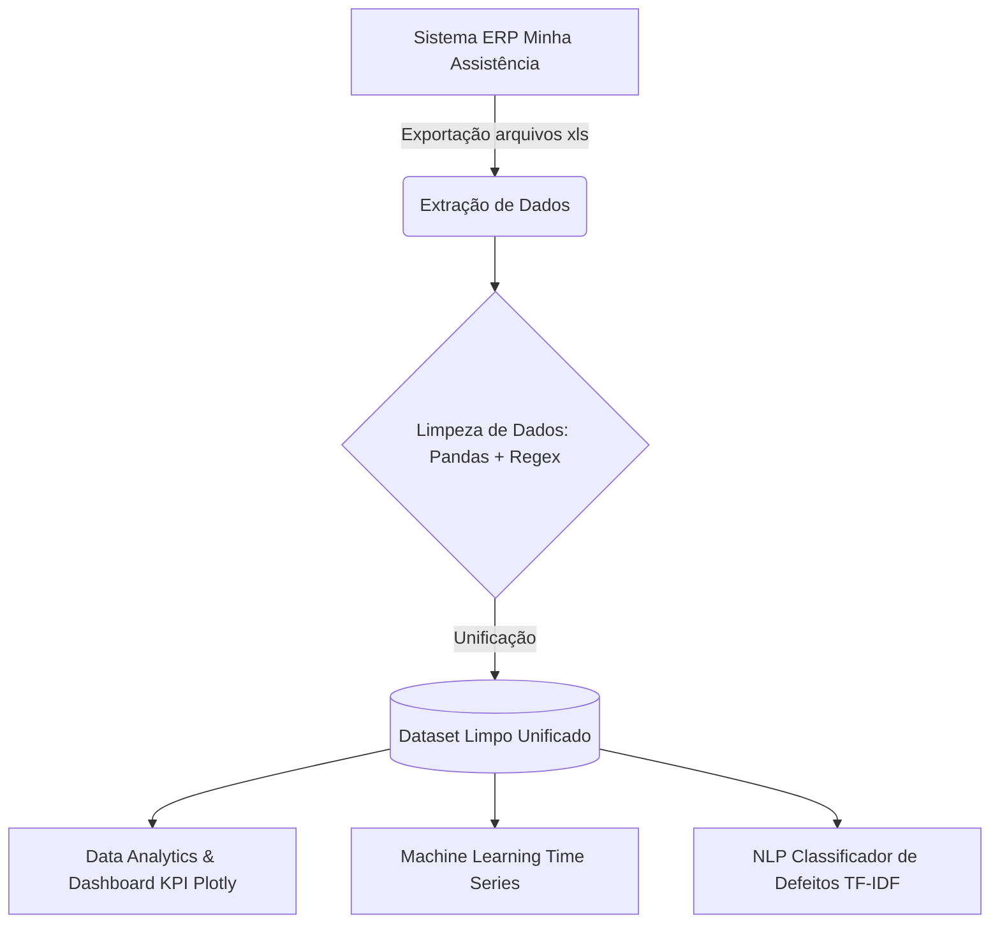

<div align="center">
  <h1>📱 From Repair Shop Data to AI-Driven Business Intelligence</h1>
  <h3>Mix Cell Analytics & AI</h3>
  <p>Pipeline completo de Análise de Dados, Machine Learning e NLP para otimização de uma loja de reparo de celulares.</p>
</div>

<br>

<div align="center">
  
  
  
  
</div>

---

## 📌 O Problema de Negócio
A Mix Cell é uma assistência técnica de aparelhos celulares com mais de 3 anos de mercado. Diariamente, a loja gera dezenas de Ordens de Serviço (OS), porém todos os dados ficavam "presos" no sistema de ERP como informações mortas.

O objetivo deste projeto foi **extrair inteligência competitiva** desses 3 anos de dados brutos, respondendo perguntas estratégicas sobre o faturamento, prevendo o caixa futuro com IA e treinando um modelo de Linguagem Natural para automação de triagem.

---

## 🏗️ Arquitetura do Pipeline



---

## 📊 O Dataset

*   **Tamanho:** +2.700 ordens de serviço (OS)
*   **Período:** 3 anos de histórico operacional financeiro e laboratorial (2023 - 2026)
*   **Features principais (Visão Global):**
    *   `device_model` (Modelo do aparelho)
    *   `defect_description` (Descrição original do problema)
    *   `repair_value` (Valor financeiro gerado pelo serviço)
    *   `repair_date` (Data de entrada na bancada)
    *   `service_category` (Categoria de peça do reparo efetuado)

---

## 🚀 Os Desafios e Soluções (Projetos)

### 1️⃣ Projeto 1: Análise Operacional e KPIs (Data Analytics)
Transformação de 11 planilhas confusas em um *Data Lake* unificado.
*   **Ação:** Limpeza de texto usando algoritmos de *Regex* e funções vectorizadas no **Pandas**. Conversão de *strings* financeiras brasileiras (ex: "R$ 1.500,00" para valores limpos interpretáveis).
*   **Resultados de Negócio:**
    *   Faturamento Histórico Analisado e Limpo: **R$ 640k+**
    *   Ticket Médio Geral identificado: **R$ 236,00**
    *   Mapeamento exato de *Market Share* de laboratório (Samsung dominando o volume de OS, e Apple garantindo o maior Ticket Médio isolado de lucratividade).


### 2️⃣ Projeto 2: Previsão de Faturamento Diário (Machine Learning)
Aplicações de algoritmos preditivos de série temporal para projetar os ganhos diários dos próximos 90 dias estipulando sazonalidade.
*   **Ação:** *Feature Engineering* intensivo, isolando e fragmentando a cronologia em colunas numéricas (Dia da Semana, Dia do Mês, Trimestre).
*   **O Modelo:** Treinamento robusto de uma Floresta Aleatória de Decisões (**Random Forest Regressor** via `scikit-learn`) provendo aprendizado sob sazonalidade histórica comercial sem sobreajuste.
*   **A Entrega:** A IA elaborou com precisão matemática uma projeção automática de **R$ 67.892,00** para os próximos 3 meses de operação de loja física.


### 3️⃣ Projeto 3: Motor de NLP para Triagem de Defeitos
Cérebro do assistente de Inteligência Artificial focado em compreender e rotular a linguagem coloquial do cliente B2C.
*   **Ação:** Criação e enriquecimento de dados sintéticos (*Data Augmentation*) para preencher o vazio das descrições muito técnicas encontradas no balcão e re-simular a linguagem chorosa do humano (ex: *"celular caiu no banho e a tela tá tudo preta com risco"*).
*   **Vetorização Matemática:** Pipeline criado usando **TF-IDF Vectorizer** (Term Frequency-Inverse Document Frequency) a fim de calcular o peso idiomático em português.
*   **O Classificador:** Diagnóstico provido pautado em Teoremas de Bayes (**Naive Bayes** multinominal) instanciado em `.pkl` local de pronto-consumo.


---

## 🛠️ Como rodar este projeto?

O projeto está dividido em scripts independentes na pasta raiz.
```bash
# 1. Instale as dependências
pip install pandas plotly scikit-learn jinja2 openpyxl

# 2. Rode o Script de Data Analytics e KPIs (Projeto 1)
python dashboard_kpis.py

# 3. Rode o Script de ML para Previsão de Séries Temporais (Projeto 2)
python previsao_ml.py

# 4. Inicie o Modo Chatbot de Linguagem Natural (Projeto 3)
python previsor_defeitos_nlp.py --chat

# 5. Gere o Extrato VIP de Marketing Interno (LTV)
python analise_vip.py
```

---
*Este é um projeto construído e orquestrado para solucionar gargalos de inteligência no universo de Microempreendedores (Small Business) através da Engenharia de Dados Orientada ao Negócio.*


